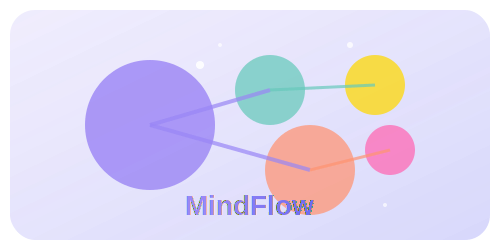

# MindFlow: Interactive Mind Mapping Tool

<div align="center">
  
</div>

## 🧠 CodeCircuit Hackathon Submission

MindFlow is an interactive mind map builder with auto-expanding nodes, created for the CodeCircuit Hackathon. Transform complex thoughts into clear, organized visual concepts with our intuitive drag-and-drop interface.

## ✨ Key Features

- **Interactive Mind Mapping**: Create stunning visual maps with our intuitive drag-and-drop interface
- **Smart Connections**: Connect ideas seamlessly with automatic node expansion and organization
- **Template Library**: Jumpstart your creativity with pre-designed templates for various use cases
- **Node Attachments**: Attach links, images, and files to your nodes for comprehensive reference
- **Priority & Tags**: Organize your thoughts with priority levels and custom tags
- **Import/Export**: Save and share your mind maps with JSON export/import functionality
- **Dark/Light Mode**: Work comfortably in any environment with theme support
- **Responsive Design**: Perfect experience on both desktop and mobile

## 🚀 Live Demo

Try it out: [MindFlow Demo](https://mindspark-flow-builder.vercel.app/](https://mindspark-flow-builder-main.vercel.app/))

## 🛠️ Technology Stack

- **React** with TypeScript
- **React Flow** for node-based visualization
- **Zustand** for state management
- **Tailwind CSS** for styling
- **Framer Motion** for animations
- **Lucide Icons** for beautiful UI elements

## 🎬 How to Use

1. **Create a Mind Map**: Start from scratch or choose a template
2. **Add Nodes**: Click the + button to add connected nodes
3. **Organize Ideas**: Drag nodes to position them perfectly
4. **Customize Nodes**: Change colors, add attachments, notes, and tags
5. **Export Your Work**: Save as JSON or share with others

## 🧩 Template Gallery

- **Project Planning**: Organize your project ideas and tasks
- **Idea Generation**: Capture and organize your creative ideas
- **SWOT Analysis**: Analyze Strengths, Weaknesses, Opportunities, and Threats
- **And more!**

## 💡 Use Cases

- **Students**: Create study guides and connect complex concepts
- **Professionals**: Plan projects and organize business strategies
- **Creatives**: Develop ideas and map out creative processes
- **Educators**: Create visual teaching materials

## 📱 Mobile Ready

MindFlow is fully responsive, allowing you to create and edit mind maps on the go. The touch-friendly interface makes it easy to use on tablets and smartphones.

## 📋 Implementation Details

The mind map is built using React Flow for node visualization and interaction. The custom node components support various features:

- Advanced animations for a smooth, engaging experience
- Node attachments for links, images, and files
- Priority levels (low, medium, high) with visual indicators
- Custom tags for better organization
- Detailed notes for comprehensive information
- Beautiful color schemes with interactive gradients

## ⭐ What Makes MindFlow Unique

1. **Fluid User Experience**: Smooth animations, transitions, and interactions make mapping a joy
2. **Visual Richness**: Dynamic gradients, lighting effects, and responsive feedback
3. **Information Density**: Compact but comprehensive display of complex information
4. **Accessibility**: Thoughtful design for keyboard navigation and screen readers
5. **Flexibility**: Quickly switch between structured and free-form mapping styles

## 📈 Future Enhancements

- Collaborative editing for team collaboration
- Enhanced suggestion system for related concepts
- Enhanced export options (PNG, PDF, SVG)
- More specialized templates for different industries
- Voice input for quick node creation

## 👨‍💻 Development

```bash
# Clone the repository
git clone https://github.com/Kunal-Darekar/mindspark-flow-builder-main

# Install dependencies
npm install

# Start the development server
npm run dev
```


